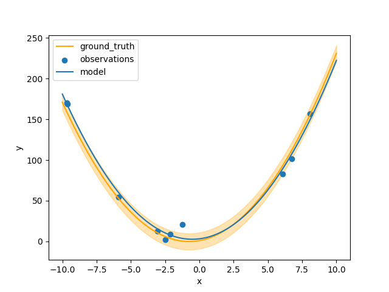
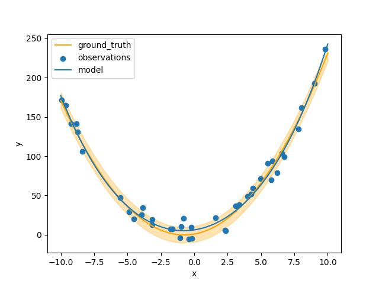

# Command Line Interface Overview

The command line interface allows us to load and save `States` and run arbitrary functions on them.

## Setup

To use the command line, we first define a package `example` containing the functions we want to run on the State:

```python title="example/lib.py"
--8<-- "https://raw.githubusercontent.com/AutoResearch/autora-core/main/docs/cli/basic-usage/example/lib.py"
```

```python title="example/__init__.py"
--8<-- "https://raw.githubusercontent.com/AutoResearch/autora-core/main/docs/cli/basic-usage/example/__init__.py"
```

We can run the pipeline of initialization, condition generation, experiment and theory building as follows.

First we create an initial state file:

```shell
python -m autora.workflow example.lib.initial_state --out-path initial.pkl
```

Next we run the condition generation:


```shell
python -m autora.workflow example.lib.experimentalist --in-path initial.pkl --out-path conditions.pkl
```

We run the experiment:


```shell
python -m autora.workflow example.lib.experiment_runner --in-path conditions.pkl --out-path experiment_data.pkl
```

And then the theorist:


```shell
python -m autora.workflow example.lib.theorist --in-path experiment_data.pkl --out-path model.pkl
```

We can interrogate the results by loading them into the current session.


```python
#!/usr/bin/env python
from autora.workflow.__main__ import load_state
state = load_state("model.pkl")
print(state)
# state = 
# StandardState(
#     variables=VariableCollection(
#         independent_variables=[
#             Variable(name='x',
#                      value_range=None, 
#                      allowed_values=array([-10.  ,  -9.98,  -9.96, ...,   9.96,   9.98,  10.  ]), 
#                      units='', 
#                      type=<ValueType.REAL: 'real'>, 
#                      variable_label='', 
#                      rescale=1, 
#                      is_covariate=False)
#             ], 
#         dependent_variables=[
#             Variable(name='y', 
#                      value_range=None, 
#                      allowed_values=None, 
#                      units='', 
#                      type=<ValueType.REAL: 'real'>, 
#                      variable_label='', 
#                      rescale=1, 
#                      is_covariate=False)
#         ], 
#         covariates=[]
#     ), 
#     conditions=        x
#                342 -3.16
#                869  7.38
#                732  4.64
#                387 -2.26
#                919  8.38
#                949  8.98
#                539  0.78
#                563  1.26
#                855  7.10
#                772  5.44, 
#     experiment_data=      x           y
#                     0 -3.16    1.257587
#                     1  7.38  153.259915
#                     2  4.64   54.291348
#                     3 -2.26   10.374509
#                     4  8.38  155.483778
#                     5  8.98  183.774472
#                     6  0.78    3.154024
#                     7  1.26   14.033608
#                     8  7.10  103.032008
#                     9  5.44   94.629911, 
#     models=[
#         GridSearchCV(
#             estimator=Pipeline(steps=[
#                 ('polynomialfeatures', PolynomialFeatures()),
#                 ('linearregression', LinearRegression())]),
#             param_grid={'polynomialfeatures__degree': [0, 1, 2, 3, 4]}, 
#             scoring='r2'
#         )
#     ]
# )
```

`state` is the following object which, once loaded, can be treated like any other `State` object.
For instance, we can plot the results:

```python title="example/plot.py"
--8<-- "https://raw.githubusercontent.com/AutoResearch/autora-core/main/docs/cli/basic-usage/example/plot.py"
```
    
```shell
python -m example.plot model.pkl
```




If we instead run the experiment for 4 cycles, we can get results closer to the ground truth.

```shell
set -x  # echo each command 

python -m autora.workflow example.lib.initial_state --out-path "result.pkl"

for i in {1..4}
do
    python -m autora.workflow example.lib.experimentalist --in-path "result.pkl" --out-path "result.pkl"
    python -m autora.workflow example.lib.experiment_runner --in-path "result.pkl" --out-path "result.pkl"
    python -m autora.workflow example.lib.theorist --in-path "result.pkl" --out-path "result.pkl"
done

python example.plot result.pkl
```


