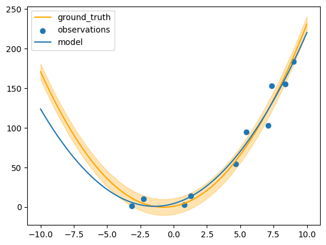
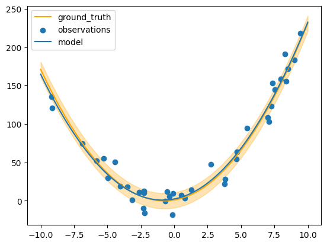
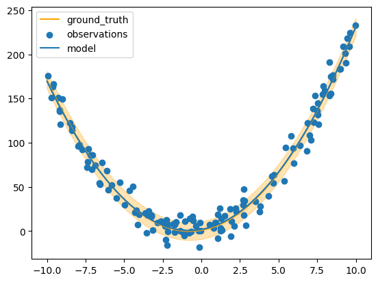

# Basic usage

The command line interface allows us to load and save `States` and run arbitrary functions on them.

## Setup

To use the command line, we first define a file containing the functions we want to run on the State.

```python title="lib.py"
--8<-- "https://raw.githubusercontent.com/AutoResearch/autora-core/main/docs/cli/basic-usage/lib/python/lib.py"
```

We can run the pipeline of initialization, condition generation, experiment and theory building as follows.

First we create an initial state file:

```shell
python -m autora.workflow lib.initial_state --out-path initial.pkl
```

Next we run the condition generation:


```shell
python -m autora.workflow lib.experimentalist --in-path initial.pkl --out-path conditions.pkl
```

We run the experiment:


```shell
python -m autora.workflow lib.experiment_runner --in-path conditions.pkl --out-path experiment_data.pkl
```

And then the theorist:


```shell
python -m autora.workflow lib.theorist --in-path experiment_data.pkl --out-path model.pkl
```

We can interrogate the results by loading them into the current session.


```python
from autora.workflow.__main__ import load_state
s = load_state("model.pkl")
```

`s` is the following object: 
```python
StandardState(
    variables=VariableCollection(
        independent_variables=[
            Variable(name='x',
                     value_range=None, 
                     allowed_values=array([-10.  ,  -9.98,  -9.96, ...,   9.96,   9.98,  10.  ]), 
                     units='', 
                     type=<ValueType.REAL: 'real'>, 
                     variable_label='', 
                     rescale=1, 
                     is_covariate=False)
            ], 
        dependent_variables=[
            Variable(name='y', 
                     value_range=None, 
                     allowed_values=None, 
                     units='', 
                     type=<ValueType.REAL: 'real'>, 
                     variable_label='', 
                     rescale=1, 
                     is_covariate=False)
        ], 
        covariates=[]
    ), 
    conditions=        x
               342 -3.16
               869  7.38
               732  4.64
               387 -2.26
               919  8.38
               949  8.98
               539  0.78
               563  1.26
               855  7.10
               772  5.44, 
    experiment_data=      x           y
                    0 -3.16    1.257587
                    1  7.38  153.259915
                    2  4.64   54.291348
                    3 -2.26   10.374509
                    4  8.38  155.483778
                    5  8.98  183.774472
                    6  0.78    3.154024
                    7  1.26   14.033608
                    8  7.10  103.032008
                    9  5.44   94.629911, 
    models=[
        GridSearchCV(
            estimator=Pipeline(steps=[
                ('polynomialfeatures', PolynomialFeatures()),
                ('linearregression', LinearRegression())]),
             param_grid={'polynomialfeatures__degree': [0, 1, 2, 3, 4]}, scoring='r2')]
)
```

    StandardState(variables=VariableCollection(independent_variables=[Variable(name='x', value_range=None, allowed_values=array([-10.  ,  -9.98,  -9.96, ...,   9.96,   9.98,  10.  ]), units='', type=<ValueType.REAL: 'real'>, variable_label='', rescale=1, is_covariate=False)], dependent_variables=[Variable(name='y', value_range=None, allowed_values=None, units='', type=<ValueType.REAL: 'real'>, variable_label='', rescale=1, is_covariate=False)], covariates=[]), conditions=        x
    342 -3.16
    869  7.38
    732  4.64
    387 -2.26
    919  8.38
    949  8.98
    539  0.78
    563  1.26
    855  7.10
    772  5.44, experiment_data=      x           y
    0 -3.16    1.257587
    1  7.38  153.259915
    2  4.64   54.291348
    3 -2.26   10.374509
    4  8.38  155.483778
    5  8.98  183.774472
    6  0.78    3.154024
    7  1.26   14.033608
    8  7.10  103.032008
    9  5.44   94.629911, models=[GridSearchCV(estimator=Pipeline(steps=[('polynomialfeatures',
                                            PolynomialFeatures()),
                                           ('linearregression',
                                            LinearRegression())]),
                 param_grid={'polynomialfeatures__degree': [0, 1, 2, 3, 4]},
                 scoring='r2')])


We have three new fields in the state. The first is the conditions, a sample of ten values from between -10 and 10.


```python
s.conditions
```


<div>
<style scoped>
    .dataframe tbody tr th:only-of-type {
        vertical-align: middle;
    }

    .dataframe tbody tr th {
        vertical-align: top;
    }

    .dataframe thead th {
        text-align: right;
    }
</style>
<table border="1" class="dataframe">
  <thead>
    <tr style="text-align: right;">
      <th></th>
      <th>x</th>
    </tr>
  </thead>
  <tbody>
    <tr>
      <th>342</th>
      <td>-3.16</td>
    </tr>
    <tr>
      <th>869</th>
      <td>7.38</td>
    </tr>
    <tr>
      <th>732</th>
      <td>4.64</td>
    </tr>
    <tr>
      <th>387</th>
      <td>-2.26</td>
    </tr>
    <tr>
      <th>919</th>
      <td>8.38</td>
    </tr>
    <tr>
      <th>949</th>
      <td>8.98</td>
    </tr>
    <tr>
      <th>539</th>
      <td>0.78</td>
    </tr>
    <tr>
      <th>563</th>
      <td>1.26</td>
    </tr>
    <tr>
      <th>855</th>
      <td>7.10</td>
    </tr>
    <tr>
      <th>772</th>
      <td>5.44</td>
    </tr>
  </tbody>
</table>
</div>


We have experiment data corresponding to those conditions:


```python
s.experiment_data
```


<div>
<style scoped>
    .dataframe tbody tr th:only-of-type {
        vertical-align: middle;
    }

    .dataframe tbody tr th {
        vertical-align: top;
    }

    .dataframe thead th {
        text-align: right;
    }
</style>
<table border="1" class="dataframe">
  <thead>
    <tr style="text-align: right;">
      <th></th>
      <th>x</th>
      <th>y</th>
    </tr>
  </thead>
  <tbody>
    <tr>
      <th>0</th>
      <td>-3.16</td>
      <td>1.257587</td>
    </tr>
    <tr>
      <th>1</th>
      <td>7.38</td>
      <td>153.259915</td>
    </tr>
    <tr>
      <th>2</th>
      <td>4.64</td>
      <td>54.291348</td>
    </tr>
    <tr>
      <th>3</th>
      <td>-2.26</td>
      <td>10.374509</td>
    </tr>
    <tr>
      <th>4</th>
      <td>8.38</td>
      <td>155.483778</td>
    </tr>
    <tr>
      <th>5</th>
      <td>8.98</td>
      <td>183.774472</td>
    </tr>
    <tr>
      <th>6</th>
      <td>0.78</td>
      <td>3.154024</td>
    </tr>
    <tr>
      <th>7</th>
      <td>1.26</td>
      <td>14.033608</td>
    </tr>
    <tr>
      <th>8</th>
      <td>7.10</td>
      <td>103.032008</td>
    </tr>
    <tr>
      <th>9</th>
      <td>5.44</td>
      <td>94.629911</td>
    </tr>
  </tbody>
</table>
</div>


We have a best-fit linear model.


```python
s.model
```


<style>#sk-container-id-1 {color: black;}#sk-container-id-1 pre{padding: 0;}#sk-container-id-1 div.sk-toggleable {background-color: white;}#sk-container-id-1 label.sk-toggleable__label {cursor: pointer;display: block;width: 100%;margin-bottom: 0;padding: 0.3em;box-sizing: border-box;text-align: center;}#sk-container-id-1 label.sk-toggleable__label-arrow:before {content: "▸";float: left;margin-right: 0.25em;color: #696969;}#sk-container-id-1 label.sk-toggleable__label-arrow:hover:before {color: black;}#sk-container-id-1 div.sk-estimator:hover label.sk-toggleable__label-arrow:before {color: black;}#sk-container-id-1 div.sk-toggleable__content {max-height: 0;max-width: 0;overflow: hidden;text-align: left;background-color: #f0f8ff;}#sk-container-id-1 div.sk-toggleable__content pre {margin: 0.2em;color: black;border-radius: 0.25em;background-color: #f0f8ff;}#sk-container-id-1 input.sk-toggleable__control:checked~div.sk-toggleable__content {max-height: 200px;max-width: 100%;overflow: auto;}#sk-container-id-1 input.sk-toggleable__control:checked~label.sk-toggleable__label-arrow:before {content: "▾";}#sk-container-id-1 div.sk-estimator input.sk-toggleable__control:checked~label.sk-toggleable__label {background-color: #d4ebff;}#sk-container-id-1 div.sk-label input.sk-toggleable__control:checked~label.sk-toggleable__label {background-color: #d4ebff;}#sk-container-id-1 input.sk-hidden--visually {border: 0;clip: rect(1px 1px 1px 1px);clip: rect(1px, 1px, 1px, 1px);height: 1px;margin: -1px;overflow: hidden;padding: 0;position: absolute;width: 1px;}#sk-container-id-1 div.sk-estimator {font-family: monospace;background-color: #f0f8ff;border: 1px dotted black;border-radius: 0.25em;box-sizing: border-box;margin-bottom: 0.5em;}#sk-container-id-1 div.sk-estimator:hover {background-color: #d4ebff;}#sk-container-id-1 div.sk-parallel-item::after {content: "";width: 100%;border-bottom: 1px solid gray;flex-grow: 1;}#sk-container-id-1 div.sk-label:hover label.sk-toggleable__label {background-color: #d4ebff;}#sk-container-id-1 div.sk-serial::before {content: "";position: absolute;border-left: 1px solid gray;box-sizing: border-box;top: 0;bottom: 0;left: 50%;z-index: 0;}#sk-container-id-1 div.sk-serial {display: flex;flex-direction: column;align-items: center;background-color: white;padding-right: 0.2em;padding-left: 0.2em;position: relative;}#sk-container-id-1 div.sk-item {position: relative;z-index: 1;}#sk-container-id-1 div.sk-parallel {display: flex;align-items: stretch;justify-content: center;background-color: white;position: relative;}#sk-container-id-1 div.sk-item::before, #sk-container-id-1 div.sk-parallel-item::before {content: "";position: absolute;border-left: 1px solid gray;box-sizing: border-box;top: 0;bottom: 0;left: 50%;z-index: -1;}#sk-container-id-1 div.sk-parallel-item {display: flex;flex-direction: column;z-index: 1;position: relative;background-color: white;}#sk-container-id-1 div.sk-parallel-item:first-child::after {align-self: flex-end;width: 50%;}#sk-container-id-1 div.sk-parallel-item:last-child::after {align-self: flex-start;width: 50%;}#sk-container-id-1 div.sk-parallel-item:only-child::after {width: 0;}#sk-container-id-1 div.sk-dashed-wrapped {border: 1px dashed gray;margin: 0 0.4em 0.5em 0.4em;box-sizing: border-box;padding-bottom: 0.4em;background-color: white;}#sk-container-id-1 div.sk-label label {font-family: monospace;font-weight: bold;display: inline-block;line-height: 1.2em;}#sk-container-id-1 div.sk-label-container {text-align: center;}#sk-container-id-1 div.sk-container {/* jupyter's `normalize.less` sets `[hidden] { display: none; }` but bootstrap.min.css set `[hidden] { display: none !important; }` so we also need the `!important` here to be able to override the default hidden behavior on the sphinx rendered scikit-learn.org. See: https://github.com/scikit-learn/scikit-learn/issues/21755 */display: inline-block !important;position: relative;}#sk-container-id-1 div.sk-text-repr-fallback {display: none;}</style><div id="sk-container-id-1" class="sk-top-container"><div class="sk-text-repr-fallback"><pre>GridSearchCV(estimator=Pipeline(steps=[(&#x27;polynomialfeatures&#x27;,
                                        PolynomialFeatures()),
                                       (&#x27;linearregression&#x27;,
                                        LinearRegression())]),
             param_grid={&#x27;polynomialfeatures__degree&#x27;: [0, 1, 2, 3, 4]},
             scoring=&#x27;r2&#x27;)</pre><b>In a Jupyter environment, please rerun this cell to show the HTML representation or trust the notebook. <br />On GitHub, the HTML representation is unable to render, please try loading this page with nbviewer.org.</b></div><div class="sk-container" hidden><div class="sk-item sk-dashed-wrapped"><div class="sk-label-container"><div class="sk-label sk-toggleable"><input class="sk-toggleable__control sk-hidden--visually" id="sk-estimator-id-1" type="checkbox" ><label for="sk-estimator-id-1" class="sk-toggleable__label sk-toggleable__label-arrow">GridSearchCV</label><div class="sk-toggleable__content"><pre>GridSearchCV(estimator=Pipeline(steps=[(&#x27;polynomialfeatures&#x27;,
                                        PolynomialFeatures()),
                                       (&#x27;linearregression&#x27;,
                                        LinearRegression())]),
             param_grid={&#x27;polynomialfeatures__degree&#x27;: [0, 1, 2, 3, 4]},
             scoring=&#x27;r2&#x27;)</pre></div></div></div><div class="sk-parallel"><div class="sk-parallel-item"><div class="sk-item"><div class="sk-label-container"><div class="sk-label sk-toggleable"><input class="sk-toggleable__control sk-hidden--visually" id="sk-estimator-id-2" type="checkbox" ><label for="sk-estimator-id-2" class="sk-toggleable__label sk-toggleable__label-arrow">estimator: Pipeline</label><div class="sk-toggleable__content"><pre>Pipeline(steps=[(&#x27;polynomialfeatures&#x27;, PolynomialFeatures()),
                (&#x27;linearregression&#x27;, LinearRegression())])</pre></div></div></div><div class="sk-serial"><div class="sk-item"><div class="sk-serial"><div class="sk-item"><div class="sk-estimator sk-toggleable"><input class="sk-toggleable__control sk-hidden--visually" id="sk-estimator-id-3" type="checkbox" ><label for="sk-estimator-id-3" class="sk-toggleable__label sk-toggleable__label-arrow">PolynomialFeatures</label><div class="sk-toggleable__content"><pre>PolynomialFeatures()</pre></div></div></div><div class="sk-item"><div class="sk-estimator sk-toggleable"><input class="sk-toggleable__control sk-hidden--visually" id="sk-estimator-id-4" type="checkbox" ><label for="sk-estimator-id-4" class="sk-toggleable__label sk-toggleable__label-arrow">LinearRegression</label><div class="sk-toggleable__content"><pre>LinearRegression()</pre></div></div></div></div></div></div></div></div></div></div></div></div>


... which we can plot:


```python
import numpy as np
from matplotlib import pyplot as plt

from lib import ground_truth, noise_std

def plot_results(state):
    x = np.linspace(-10, 10, 100).reshape((-1, 1))
    plt.plot(x, ground_truth(x), label="ground_truth", c="orange")
    plt.fill_between(x.flatten(), ground_truth(x).flatten() + noise_std, ground_truth(x).flatten() - noise_std,
                     alpha=0.3, color="orange")
    
    xi, yi = state.experiment_data["x"], state.experiment_data["y"]
    plt.scatter(xi, yi, label=f"observations")
    
    plt.plot(x, state.model.predict(x), label="model")
    
    plt.legend()

plot_results(s)
```

    /Users/jholla10/Developer/autora-workflow/.venv/lib/python3.8/site-packages/sklearn/base.py:464: UserWarning: X does not have valid feature names, but PolynomialFeatures was fitted with feature names
      warnings.warn(


    

    


If we run the experiment for another 3 cycles, we can get results closer to the ground truth. In this example, we overwrite the results file each time the CLI is called.


```python
!cp "model.pkl" "result.pkl"
for i in range(3):
    !python -m autora.workflow lib.experimentalist --in-path "result.pkl" --out-path "result.pkl"
    !python -m autora.workflow lib.experiment_runner --in-path "result.pkl" --out-path "result.pkl"
    !python -m autora.workflow lib.theorist --in-path "result.pkl" --out-path "result.pkl"

```


```python
state_after_three_more_cycles = load_state("result.pkl")
plot_results(state_after_three_more_cycles)
```

    /Users/jholla10/Developer/autora-workflow/.venv/lib/python3.8/site-packages/sklearn/base.py:464: UserWarning: X does not have valid feature names, but PolynomialFeatures was fitted with feature names
      warnings.warn(


    

    


We can continue to run for as long as we like, e.g. another 10 cycles:


```python
!cp "result.pkl" "result-10.pkl"
for i in range(10):
    !python -m autora.workflow lib.experimentalist --in-path "result-10.pkl" --out-path "result-10.pkl"
    !python -m autora.workflow lib.experiment_runner --in-path "result-10.pkl" --out-path "result-10.pkl"
    !python -m autora.workflow lib.theorist --in-path "result-10.pkl" --out-path "result-10.pkl"

state_after_ten_more_cycles = load_state("result-10.pkl")

plot_results(state_after_ten_more_cycles)
```

    /Users/jholla10/Developer/autora-workflow/.venv/lib/python3.8/site-packages/sklearn/base.py:464: UserWarning: X does not have valid feature names, but PolynomialFeatures was fitted with feature names
      warnings.warn(


    

    

